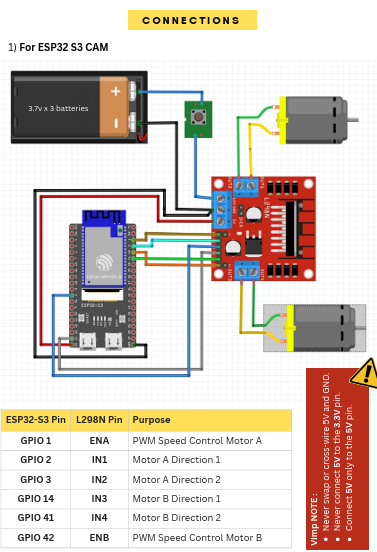
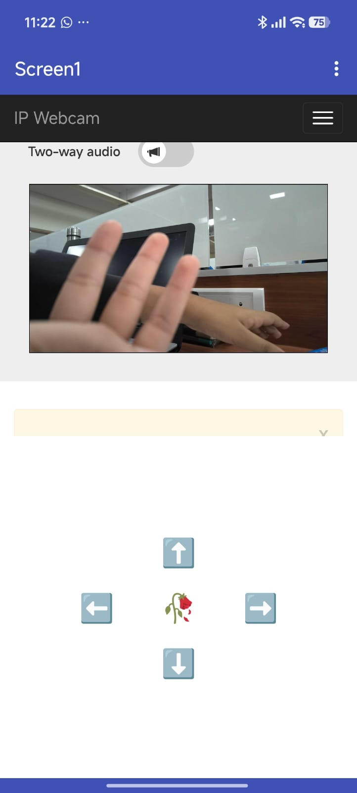
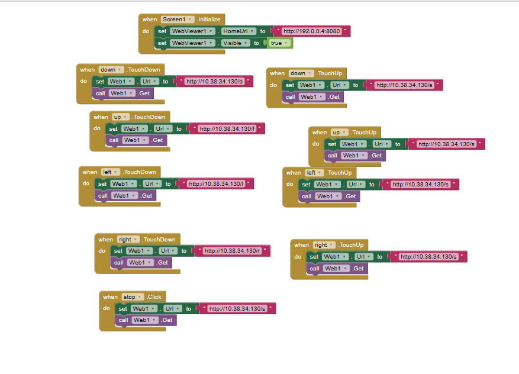
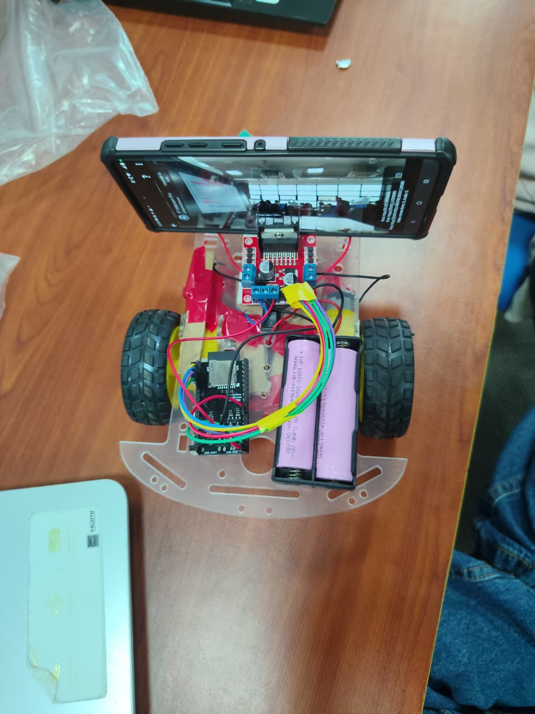
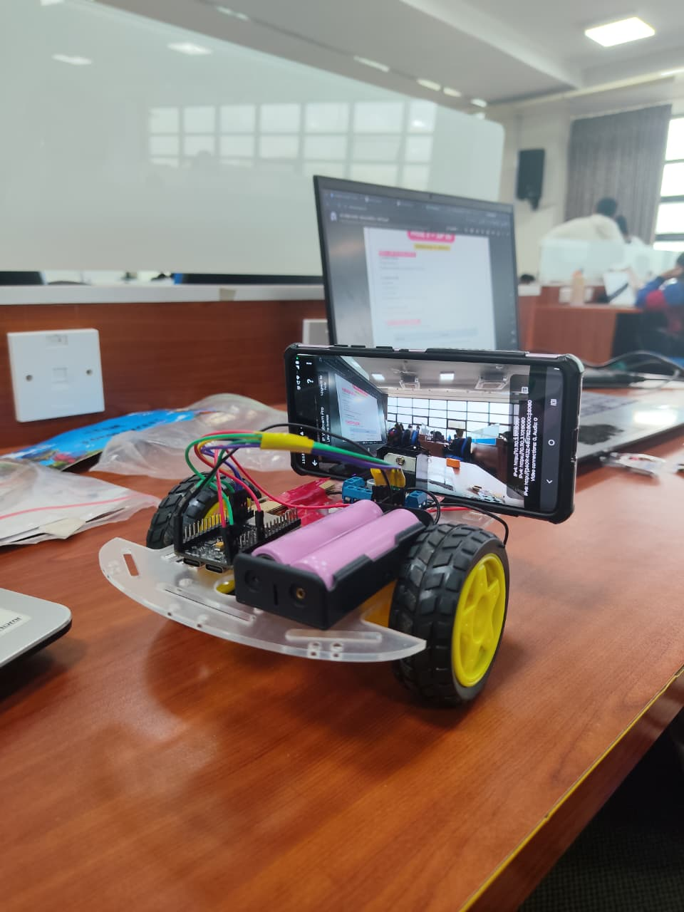

# FPV Wireless Robot

A wireless FPV robot built as part of IEEE CASS Summer of Projects 2026 at BMSIT.

## Overview

This robot uses an ESP32-S3-CAM to control two DC motors through an L298N motor driver.
The robot is controlled wirelessly using a custom MIT App Inventor controller app.

A smartphone mounted on the robot provides the live FPV camera feed, while a second smartphone is used as the controller.

## Hardware

- ESP32-S3-CAM
- L298N Motor Driver
- 2 × DC Gear Motors
- Caster Wheel
- Robot Chassis
- 3 × 3.7V Batteries
- Jumper Wires
- 2 × Smartphones
  - Camera Phone
  - Controller Phone

## How It Works

The ESP32 connects to the same Wi-Fi network as the controller phone.
The MIT App Inventor application sends movement commands to the ESP32 through HTTP requests.

The ESP32 receives these commands and controls the motors through the L298N motor driver.

The second smartphone mounted on the robot provides the live FPV video feed.

### Basic Control

| Command | Action |
|---------|--------|
| Forward | Move forward |
| Backward | Move backward |
| Left | Turn left |
| Right | Turn right |
| Stop | Stop |

## Components & Connections

<table>
  <tr>
    <td></td>
    <td>### ESP32-S3-CAM → L298N

| ESP32 Pin | L298N Pin | Function |
|-----------|-----------|----------|
| GPIO 1 | ENA | Motor A PWM |
| GPIO 2 | IN1 | Motor A direction |
| GPIO 3 | IN2 | Motor A direction |
| GPIO 14 | IN3 | Motor B direction |
| GPIO 41 | IN4 | Motor B direction |
| GPIO 42 | ENB | Motor B PWM |
</td>
  </tr>
</table>

## MIT App Inventor Controller

The robot is controlled using a custom mobile application built with MIT App Inventor.

The app sends commands to the ESP32 over Wi-Fi and provides controls for:

- Forward
- Backward
- Left
- Right
- Stop

### App Interface

<table>
  <tr>
    <td></td>
     <td></td>    
  </tr>
</table>

## FPV Camera

A second smartphone is mounted on the robot and used as the camera.

The phone runs an IP Webcam application and provides a live video stream to the controller phone.

## Software

- Arduino IDE
- ESP32 board support
- C/C++
- MIT App Inventor
- IP Webcam

## Project Photos

<table>
  <tr>
    <td></td>
    <td></td>

  </tr>
</table>

## What I Learned

- Wireless robot control using ESP32
- ESP32 Wi-Fi communication
- HTTP-based communication
- Motor control using an L298N motor driver
- PWM-based motor speed control
- MIT App Inventor
- FPV camera integration
- Hardware and wireless communication debugging

## Project Outcome

Successfully built and tested a wireless FPV robot that could be controlled through a custom mobile application while providing a live camera view.

## Future Improvements

- Improve wireless control responsiveness
- Add variable speed control
- Improve the controller interface
- Add obstacle detection
- Explore autonomous navigation
